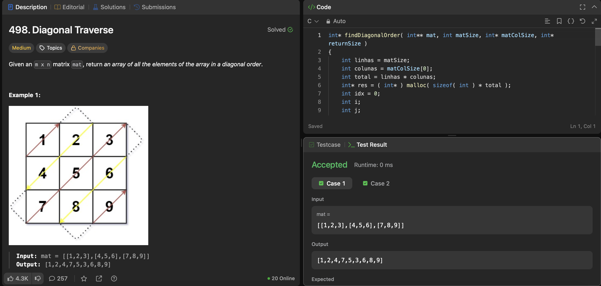

# Trabalho - LeetCode: Diagonal Traverse

## 👤 Informações
Nome: João Falcão Migliori Brito
Turma: M1

## 🔗 Problema
Link: https://leetcode.com/problems/diagonal-traverse/

O problema consiste em percorrer uma matriz em ordem diagonal,
alternando entre subir e descer, e retornar um vetor com os elementos
nessa ordem.
A ideia da solução foi percorrer a matriz pelas diagonais. Para isso,
eu uso a soma dos índices (linha + coluna) para saber em qual diagonal
estou, e dependendo se essa soma é par ou ímpar eu percorro a diagonal
em um sentido ou no outro.

## 🧪 Casos de teste

### Caso 1
Entrada:
[[1,2,3],
 [4,5,6],
 [7,8,9]]

Saída:
[1,2,4,7,5,3,6,8,9]

---

### Caso 2
Entrada:
[[1,2],
 [3,4]]

Saída:
[1,2,3,4]

---

### Caso 3
Entrada:
[[1]]

Saída:
[1]

---

## Comparação com o editorial

O editorial também percorre a matriz pelas diagonais, alternando
a direção a cada vez.

A minha solução faz basicamente a mesma coisa, usando a soma dos índices
para separar as diagonais e mudando o sentido dependendo disso.

---

## Dificuldades

Tive dificuldade em:
- Pensar numa lógica pra resolver o problema
- Controlar os limites da matriz

Usei ajuda de IA para:
- Revisar formatação estilo Doom 3
- Testes de erros de memória
- Formatação do README

---
