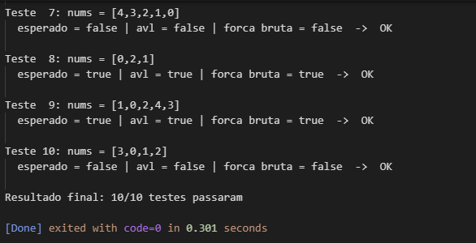
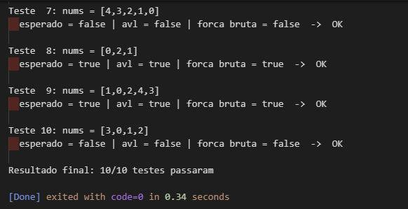

# João Falcão Migliori Brito - M1

## LeetCode 775 - Inversoes Globais e Locais ( Global and Local Inversions )
### Use avl na solucao

### Voce recebe um array de inteiros nums de comprimento n que representa uma permutacao de todos os inteiros no intervalo [0, n - 1].

### O numero de inversoes GLOBAIS e o numero de pares ( i, j ) diferentes onde:

### 0 <= i < j < n  e  nums[i] > nums[j]

### O numero de inversoes LOCAIS e o numero de indices i onde:

### 0 <= i < n - 1  e  nums[i] > nums[i + 1]

### Retorne true se o numero de inversoes globais for igual ao numero de inversoes locais.

## Submit do Leetcode em aula

## Submit do Leetcode em casa

